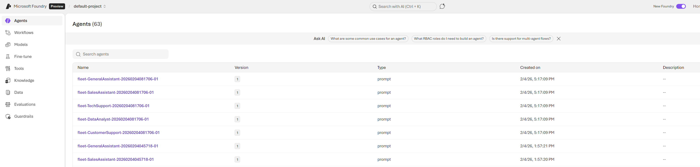
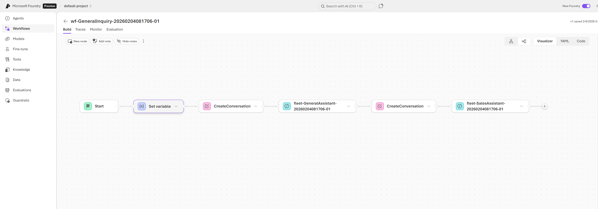
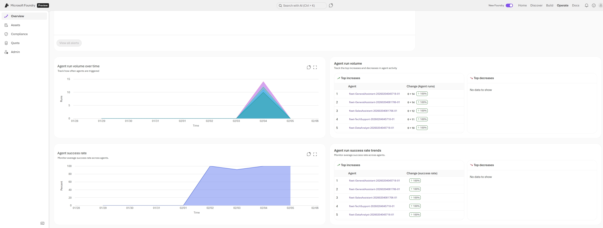
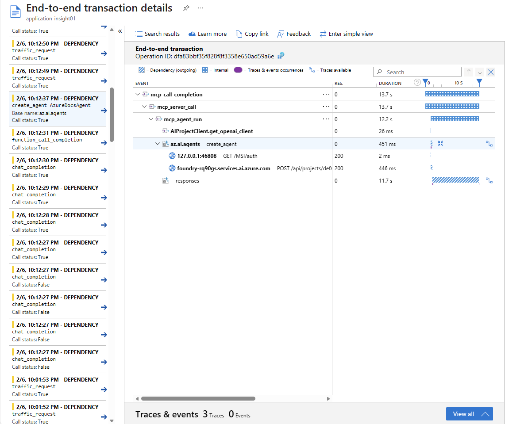
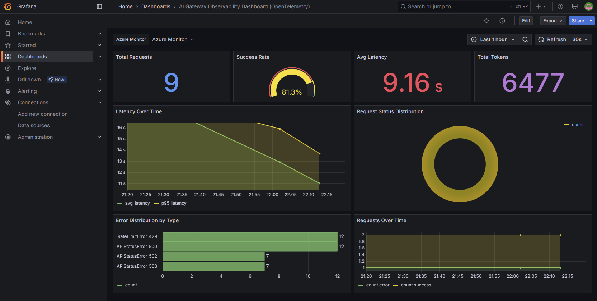

## Agent Operator Lab

This repo provides a comprehensive, hands-on workshop for **operating AI agents at scale** in **Azure AI Foundry**. It covers the full lifecycle of agent operations—from initial setup and fleet management to production-grade reliability and observability.

**What you'll learn:**

- **Control Plane Operations**: Register agents and workflows, run fleet-wide monitoring, and connect both MS Agent Framework and Hosted Agents to Azure AI Foundry
- **Workload Optimization**: Deep dive into anti-patterns vs best practices for context management, model migration strategies (canary rollout via APIM), multi-region routing, and caching techniques to reduce latency and cost
- **Reliability Patterns**: Real-world retry strategies (exponential backoff, 429/5xx handling), multi-backend fallback, and timeout management (TTFT, streaming, adaptive) with practical error injection scenarios
- **Observability**: End-to-end tracing with OpenTelemetry, Azure Application Insights integration, and Grafana dashboard visualization for AI workloads

## What's Included

### 0. Setup

- [0_setup/1_setup.ipynb](0_setup/1_setup.ipynb): Bootstrap the minimum Foundry resources (Resource Group, AIServices account, Project), discover the Project endpoint/API key, and write a local config file for reuse.

### 1. Control Plane

- [1_controlplane/1_foundry_agent_monitoring.ipynb](1_controlplane/1_foundry_agent_monitoring.ipynb): Control Plane checks with the Foundry SDK (list deployed agents, inspect assets like connections, and understand where quota is managed).
- [1_controlplane/2_ms_agent_framework_connect_foundry.ipynb](1_controlplane/2_ms_agent_framework_connect_foundry.ipynb): Connect **MS Agent Framework** agents using `AzureAIClient`, including conversation/thread linkage and tracing verification in the Foundry portal.
- [1_controlplane/3_hosted_agent_connect_foundry.ipynb](1_controlplane/3_hosted_agent_connect_foundry.ipynb): Package agents as containers, push to ACR, and register **Hosted Agents** using the Hosting Adapter (with sample agents under `1_controlplane/1.1_hosted-agent_sdk/`).
- [1_controlplane/4_agent_fleet_management.ipynb](1_controlplane/4_agent_fleet_management.ipynb): Batch registration of agents/workflows and real-time simulation with live metrics tracking in Azure AI Foundry.

### 2. Workload Optimization

- [2_workload_optimization/1_context_optimization.ipynb](2_workload_optimization/1_context_optimization.ipynb): Context optimization strategies using MCP and code execution—comparing anti-patterns vs best practices for efficient token usage.
- [2_workload_optimization/2_new_model_comparison.ipynb](2_workload_optimization/2_new_model_comparison.ipynb): Model comparison and benchmarking (latency, token usage, cost efficiency, accuracy) with the Azure OpenAI Responses API.
- [2_workload_optimization/3_model_migration.ipynb](2_workload_optimization/3_model_migration.ipynb): Model migration workflow (e.g., GPT-4.x → GPT-5.x) with APIM weighted routing (canary rollout) and acceptance criteria analysis.
- [2_workload_optimization/4_multi_region_routing.ipynb](2_workload_optimization/4_multi_region_routing.ipynb): Hands-on testing of multi-region routing strategies using APIM as a GenAI gateway—latency-based routing, weighted round robin, PTU spillover, and circuit breaker patterns.
- [2_workload_optimization/5_caching_strategies.ipynb](2_workload_optimization/5_caching_strategies.ipynb): Caching strategies to reduce latency and cost—Azure OpenAI prompt caching, Redis response caching, and semantic caching with vector similarity.

### 3. Reliability

- [3_reliability/1_retry_and_fallback.ipynb](3_reliability/1_retry_and_fallback.ipynb): Retry and fallback patterns for resilient AI applications—exponential backoff, 429/5xx error handling, and multi-backend fallback strategies.
- [3_reliability/2_timeout_management.ipynb](3_reliability/2_timeout_management.ipynb): Timeout strategies for LLM applications—TTFT vs full response timeouts, streaming timeouts, adaptive timeouts, and graceful timeout recovery.

### 4. Observability

- [4_observability/1_tracing_and_logging.ipynb](4_observability/1_tracing_and_logging.ipynb): Observability patterns with OpenTelemetry and Azure Application Insights—distributed tracing, structured logging, metrics collection, and Grafana dashboard visualization.

## Prerequisites

- Python 3.12+
- Azure CLI (`az`) and an Azure account with access to Azure AI Foundry
- For Hosted Agents: Docker and an Azure Container Registry (ACR)
- For observability: Application Insights resource
- Foundry and Project resources will be created via `az` CLI

## Setup

```bash
uv sync --prerelease=allow
source .venv/bin/activate
```

Copy environment variables:

```bash
cp sample.env .env
```

Update `.env` values as needed. The variables are organized by category:

**Azure Core**
- `AZURE_TENANT_ID`, `AZURE_SUBSCRIPTION_ID`: Your Azure tenant and subscription identifiers
- `AZURE_CONTAINER_REGISTRY`: Required for Hosted Agent container builds

**Azure OpenAI**
- `AZURE_OPENAI_ENDPOINT`: Azure OpenAI endpoint URL
- `AZURE_OPENAI_API_KEY`: Azure OpenAI API key
- `AZURE_AI_MODEL_DEPLOYMENT_NAME`, `AZURE_OPENAI_CHAT_DEPLOYMENT_NAME`: Model deployment names
- `AZURE_OPENAI_EMBEDDING_DEPLOYMENT_NAME`: Embedding model for semantic caching (e.g., `text-embedding-3-large`)

**Model Migration (Multi-Backend)**
- `BACKEND_A_AZURE_OPENAI_ENDPOINT`, `BACKEND_A_AZURE_OPENAI_API_KEY`, `BACKEND_A_DEPLOYMENT`: Primary backend (e.g., GPT-4o)
- `BACKEND_B_AZURE_OPENAI_ENDPOINT`, `BACKEND_B_AZURE_OPENAI_API_KEY`, `BACKEND_B_DEPLOYMENT`: Secondary backend (e.g., GPT-5.x)
- `APIM_SUBSCRIPTION_KEY`: Azure API Management subscription key for routing labs
- `APIM_TEST_RUNS`, `APIM_TIMEOUT_S`: Test configuration parameters

**Observability**
- `APPLICATIONINSIGHTS_CONNECTION_STRING`: Azure Application Insights connection string
- `APPLICATIONINSIGHTS_RESOURCE_ID`: Application Insights resource ID for Grafana integration

**Caching**
- `REDIS_ENDPOINT`, `REDIS_PASSWORD`: Azure Redis Cache credentials for response/semantic caching

**Optional**
- `BING_GROUNDING_CONNECTION_NAME`: Only required for the web-search hosted agent scenario

Note: Authentication is typically done via `DefaultAzureCredential` (e.g., `az login`). Some flows may also use `AZURE_OPENAI_API_KEY` depending on the notebook/sample.

## Workshop Snapshots

This section showcases what you will experience throughout the hands-on lab.

### Agent Fleet Registration & Workflow Management

Register multiple agents and workflows in Azure AI Foundry for centralized management:





### Real-Time Agent Simulation

Run agent simulations and monitor live metrics directly in Azure AI Foundry portal:



### Distributed Tracing with OpenTelemetry

Trace agent execution flows with detailed span information via Application Insights:


### Application Insights Metrics

View aggregated metrics (latency, error rates, token usage) exported from OpenTelemetry:



### Grafana Dashboard Visualization

Visualize AI gateway metrics in Azure Managed Grafana with custom dashboards:



## Hosted Agent

Sample agents live under `1_controlplane/1.1_hosted-agent_sdk/`:

- `calculator-agent`: LangGraph + Hosting Adapter (simple arithmetic tools)
- `msft-docs-agent`: MAF-based example
- `workflow-agent`: concurrent workflow example
- `web-search-agent`: grounding with Bing Search connection

## Security Notes

- Do not commit `.env` or `0_setup/.foundry_config.json` (they can contain secrets like API keys).
- If a key was ever committed, rotate the key in Azure and rewrite Git history before sharing the repo.

## ⚠️ Resource Cleanup Warning

**Important**: Running these notebooks creates Azure resources that **incur costs**. After completing the workshop, make sure to clean up resources to avoid unexpected charges:

1. **Azure Managed Grafana**: Delete via Azure Portal or run the cleanup cell in `4_observability/1_tracing_and_logging.ipynb`
2. **Azure Redis Cache**: Delete via Azure Portal or run the cleanup cell in `2_workload_optimization/5_caching_strategies.ipynb`
3. **Azure API Management**: Delete via Azure Portal if created during the model migration labs
4. **Azure Container Registry images**: Remove unused container images
5. **Application Insights**: Retain or delete based on your monitoring needs

To delete all resources in the resource group at once:

```bash
az group delete --name <your-resource-group> --yes --no-wait
```

> **Tip**: Each notebook includes a "Cleanup Resources" section at the end. Set the cleanup flag (e.g., `DELETE_RESOURCES=True`) and run the cell to remove resources created by that notebook.

